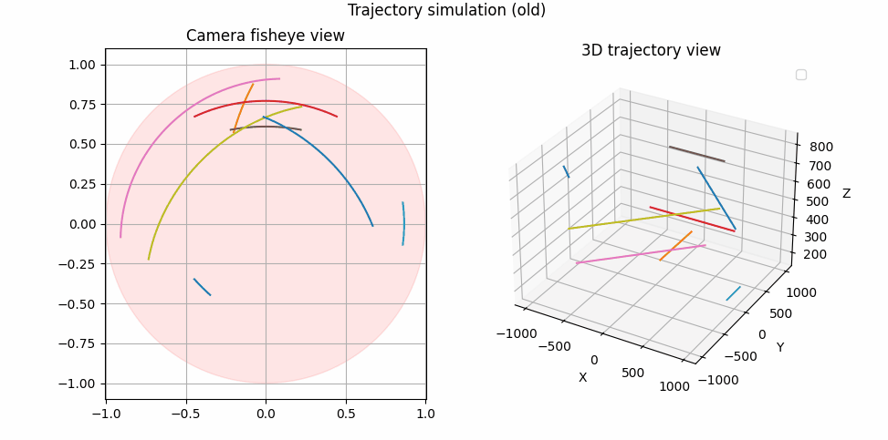
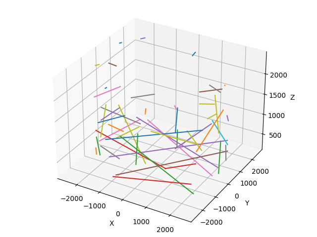
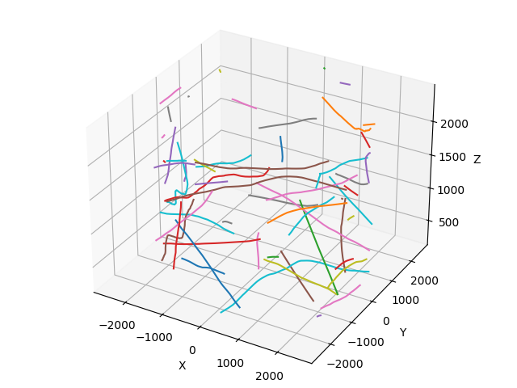
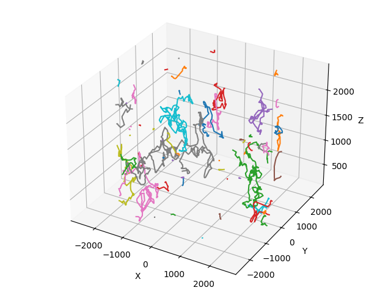
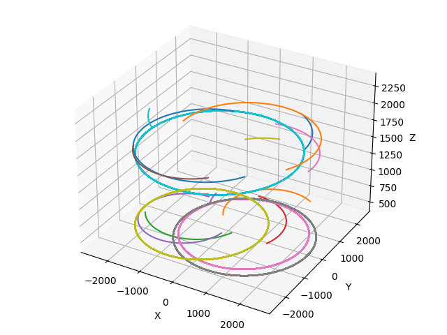

# Drone Fisheye Trajectory

## Opis

Projekt do generowania trajektorii dronów z wykorzystaniem obrazów szerokokątnych (fisheye). Narzędzie umożliwia generowanie i analizę wybranych trajektorii, a następnie konwersję pozycji rzutu kartezjańskiego na współrzędne obrazu szerokokątnego.

## Cechy

- Generowanie trajektorii dronów
- Dobór parametrów symulacji i rozdzielczości obrazu wyjściowego
- Obsługa różnych typów trajektorii (liniowa, kręta, rozproszona, okrężna)
- Tryb testowy z wizualizacją trajektorii na wykresie

## Działanie
Skrypt `fisheye.py` generuje trajektorie dronów i konwertuje ich pozycje na współrzędne obrazu szerokokątnego. Użytkownik może określić liczbę trajektorii, typ trajektorii oraz dodatkowe ziarno dla generatora liczb losowych. 

W trybie testowym trajektorie są wizualizowane na wykresie.


Obsługiwane typy trajektorii to:
- `linear` - proste trajektorie


- `squiggle` - trajektorie krzywoliniowe


- `scatter` - trajektorie rozproszone


- `circular` - trajektorie okrężne


Wyniki symulacji są zapisywane w formacie NumPy `.npy`, gdzie każdy wektor ruchu reprezentowany jest jako macierz o wymiarach `(Rpix, Rpix)`, gdzie `Rpix` to rozdzielczość obrazu wyjściowego określona w pliku `fisheye.py`.

Aby macierze wyjściowe mogły być interpretowane jako macierze Markowa, muszą być znormalizowane, tak aby suma wszystkich elementów macierzy wynosiła 1. W przypadku użycia wielu instancji symulacji, przed normalizacją należy zsumować macierze z wszystkich instancji.

Wynik znormalizowanych macierzy może wyglądać następująco:


## Instalacja

```bash
git clone https://github.com/ZonK256/drone_fisheye_trajectory.git
cd fisheye
pip install -r requirements.txt
```

## Użycie

python3 fisheye.py [-h] [--max_trajectories MAX_TRAJECTORIES] [--additional_seed ADDITIONAL_SEED] [--trajectory {linear,squiggle,scatter,circular}] [--test_mode]

```
Opcje:
    -h, --help            pokaż tę wiadomość pomocy i wyjdź
    --max_trajectories MAX_TRAJECTORIES
                                                Liczba trajektorii do wygenerowania (domyślnie: 250, jeśli 0 to nieskończenie)
    --additional_seed ADDITIONAL_SEED
                                                Dodatkowe ziarno dla generatora liczb losowych, dla wielu uruchomień z tym samym wektorem prędkości
    --trajectory {linear,squiggle,scatter,circular}
                                                Typ trajektorii do symulacji (domyślnie: linear)
    --test_mode           Włącz tryb testowy z prezentacją trajektorii na wykresie (domyślnie: False)
```

## Dodatki

output_matrix_renderer.py - Skrypt do renderowania macierzy wyjściowej jako obrazu.
run_instances.py - Skrypt do uruchamiania wielu instancji symulacji z różnymi parametrami.

## Wymagania

- Python 3.11+
- Matplotlib
- NumPy